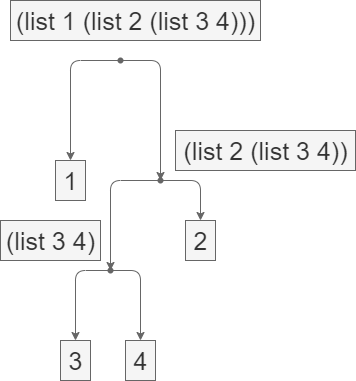

- [Exercise 2.1](#exercise-21)
  - [Answer 2.1](#answer-21)
- [Exercise 2.2](#exercise-22)
  - [Answer 2.2](#answer-22)
- [Exercise 2.3](#exercise-23)
- [Exercise 2.4](#exercise-24)
  - [Answer 2.4](#answer-24)
- [Exercise 2.5](#exercise-25)
  - [Answer 2.5](#answer-25)
- [Exercise 2.6](#exercise-26)
- [Exercise 2.7](#exercise-27)
  - [Answer 2.7](#answer-27)
- [Exercise 2.8](#exercise-28)
  - [Answer 2.8](#answer-28)
- [Exercise 2.9](#exercise-29)
  - [Answer 2.9](#answer-29)
- [Exercise 2.10](#exercise-210)
  - [Answer 2.10](#answer-210)
- [Exercise 2.11](#exercise-211)
- [Exercise 2.12](#exercise-212)
  - [Answer 2.12](#answer-212)
- [Exercise 2.13](#exercise-213)
- [Exercise 2.14](#exercise-214)
  - [Answer 2.14](#answer-214)
- [Exercise 2.15](#exercise-215)
- [Exercise 2.16](#exercise-216)
- [Exercise 2.17](#exercise-217)
  - [Answer 2.17](#answer-217)
- [Exercise 2.18](#exercise-218)
  - [Answer 2.18](#answer-218)
- [Exercise 2.19](#exercise-219)
- [Exercise 2.20](#exercise-220)
  - [Answer 2.20](#answer-220)
- [Exercise 2.21](#exercise-221)
  - [Answer 2.21](#answer-221)
- [Exercise 2.22](#exercise-222)
  - [Answer 2.22](#answer-222)
- [Exercise 2.23](#exercise-223)
  - [Answer 2.23](#answer-223)
- [Exercise 2.24](#exercise-224)
  - [Answer 2.24](#answer-224)
- [Exercise 2.25](#exercise-225)
  - [Answer 2.25](#answer-225)
- [Exercise 2.26](#exercise-226)
  - [Answer 2.26](#answer-226)
- [Exercise 2.27](#exercise-227)
  - [Answer 2.27](#answer-227)
- [Exercise 2.28](#exercise-228)
  - [Answer 2.28](#answer-228)
- [Exercise 2.29](#exercise-229)
- [Exercise 2.30](#exercise-230)
  - [Answer 2.30](#answer-230)
- [Exercise 2.31](#exercise-231)
  - [Answer 2.31](#answer-231)
- [Exercise 2.32](#exercise-232)
- [Exercise 2.33](#exercise-233)
  - [Answer 2.33](#answer-233)
- [Exercise 2.34](#exercise-234)
  - [Answer 2.34](#answer-234)
- [Exercise 2.35](#exercise-235)
  - [Answer 2.35](#answer-235)
- [Exercise 2.36](#exercise-236)
  - [Answer 2.36](#answer-236)
- [Exercise 2.37](#exercise-237)
  - [Answer 2.37](#answer-237)
- [Exercise 2.38](#exercise-238)
  - [Answer 2.38](#answer-238)
- [Exercise 2.39](#exercise-239)
- [Exercise 2.40](#exercise-240)
  - [Answer 2.40](#answer-240)
- [Exercise 2.41](#exercise-241)
  - [Answer 2.41](#answer-241)
- [Exercise 2.42](#exercise-242)
- [Exercise 2.43](#exercise-243)
- [Exercise 2.44](#exercise-244)
- [Exercise 2.45](#exercise-245)
- [Exercise 2.46](#exercise-246)
  - [Answer 2.46](#answer-246)
- [Exercise 2.47](#exercise-247)
- [Exercise 2.48](#exercise-248)
  - [Answer 2.48](#answer-248)
- [Exercise 2.49](#exercise-249)
- [Exercise 2.50](#exercise-250)
- [Exercise 2.51](#exercise-251)
- [Exercise 2.52](#exercise-252)
- [Exercise 2.53](#exercise-253)
  - [Answer 2.53](#answer-253)
- [Exercise 2.54](#exercise-254)
  - [Answer 2.54](#answer-254)
- [Exercise 2.55](#exercise-255)
  - [Answer 2.55](#answer-255)
- [Exercise 2.56](#exercise-256)
- [Exercise 2.57](#exercise-257)
- [Exercise 2.58](#exercise-258)
- [Exercise 2.59](#exercise-259)
  - [Answer 2.59](#answer-259)
- [Exercise 2.60](#exercise-260)
  - [Answer 2.60](#answer-260)
- [Exercise 2.61](#exercise-261)
  - [Answer 2.61](#answer-261)
- [Exercise 2.62](#exercise-262)
  - [Answer 2.62](#answer-262)
- [Exercise 2.63](#exercise-263)
- [Exercise 2.64](#exercise-264)
- [Exercise 2.65](#exercise-265)
- [Exercise 2.66](#exercise-266)
- [Exercise 2.67](#exercise-267)
- [Exercise 2.68](#exercise-268)
- [Exercise 2.69](#exercise-269)
- [Exercise 2.70](#exercise-270)
- [Exercise 2.71](#exercise-271)
- [Exercise 2.72](#exercise-272)

# Exercise 2.1

Define a better version of make-rat that handles both positive and negative arguments. make-rat should normalize the sign so that if the rational number is positive, both the numerator and denominator are positive, and if the rational number is negative, only the numerator is negative.

## Answer 2.1

[Scripts/make_rat.py](Scripts/make_rat.py)

# Exercise 2.2

Consider the problem of representing line segments in a plane. Each segment is represented as a pair of points: a starting point and an ending point. Define a constructor make-segment and selectors start-segment and end-segment that define the representation of segments in terms of points. Furthermore, a point can be represented as a pair of numbers: the x coordinate and the y coordinate. Accordingly, specify a constructor make-point and selectors x-point and y-point that define this representation. Finally, using your selectors and constructors, define a procedure midpoint-segment that takes a line segment as argument and returns its midpoint (the point whose coordinates are the average of the coordinates of the endpoints). To try your procedures, you’ll need a way to print points:

```scheme
(define (print-point p)
    (newline)
    (display "(")
    (display (x-point p))
    (display ",")
    (display (y-point p))
    (display ")"))
```

## Answer 2.2

[Scripts/line_segments.py](Scripts/line_segments.py)

# Exercise 2.3

Implement a representation for rectangles in a plane. (Hint: You may want to make use of Exercise 2.2.) In terms of your constructors and selectors, create procedures that compute the perimeter and the area of a given rectangle. Now implement a different representation for rectangles. Can you design your system with suitable abstraction barriers, so that the same perimeter and area procedures will work using either representation?


# Exercise 2.4

Here is an alternative procedural representation of pairs. For this representation, verify that (car (cons x y)) yields x for any objects x and y.

```scheme
(define (cons x y)
    (lambda (m) (m x y)))
(define (car z)
    (z (lambda (p q) p)))
```

What is the corresponding definition of cdr? (Hint: To verify that this works, make use of the substitution model of Section 1.1.5.)

## Answer 2.4

```python
def cons(x, y):
    return lambda m : m(x, y)
def cdr(z):
    return z(lambda p, q : q)
```

# Exercise 2.5

Show that we can represent pairs of nonnegative integers using only numbers and arithmetic operations if we represent the pair a and b as the integer that is the product $2^a3^b$. Give the corresponding definitions of the procedures cons, car, and cdr.

## Answer 2.5

```python
def cons(a, b):
    return pow(2, a) * pow(3, b)

def car(z):
    a = 0
    while z % 2 == 0:
        z /= 2
        a += 1
    return a

def cdr(z):
    b = 0
    while z % 3 == 0:
        z /= 3
        b += 1
    return b
```

# Exercise 2.6

In case representing pairs as procedures wasn’t mind-boggling enough, consider that, in a language that can manipulate procedures, we can get by without numbers (at least insofar as nonnegative integers are concerned) by implementing 0 and the operation of adding 1 as

```scheme
(define zero (lambda (f) (lambda (x) x)))
(define (add-1 n)
    (lambda (f) (lambda (x) (f ((n f) x)))))
```

This representation is known as Church numerals, after its inventor, Alonzo Church, the logician who invented the λ-calculus.

Define one and two directly (not in terms of zero and add-1). (Hint: Use substitution to evaluate (add-1 zero)). Give a direct definition of the addition procedure + (not in terms of repeated application of add-1).


# Exercise 2.7

Alyssa’s program is incomplete because she has not specified the implementation of the interval abstraction. Here is a definition of the interval constructor:

```scheme
(define (make-interval a b) (cons a b))
```

Define selectors upper-bound and lower-bound to complete the implementation.

## Answer 2.7

[Scripts/interval_bounds.py](Scripts/interval_bounds.py)

# Exercise 2.8

Using reasoning analogous to Alyssa’s, describe how the difference of two intervals may be computed. Define a corresponding subtraction procedure, called sub-interval.

## Answer 2.8

[Scripts/interval_sub.py](Scripts/interval_sub.py)


# Exercise 2.9

The width of an interval is half of the difference between its upper and lower bounds. The width is a measure of the uncertainty of the number specified by the interval. For some arithmetic operations the width of the result of combining two intervals is a function only of the widths of the argument intervals, whereas for others the width of the combination is not a function of the widths of the argument intervals. Show that the width of the sum (or difference) of two intervals is a function only of the widths of the intervals being added (or subtracted). Give examples to show that this is not true for multiplication or division.

## Answer 2.9

[Scripts/interval_width.py](Scripts/interval_width.py)

# Exercise 2.10

Ben Bitdiddle, an expert systems programmer, looks over Alyssa’s shoulder and comments that it is not clear what it means to divide by an interval that spans zero. Modify Alyssa’s code to check for this condition and to signal an error if it occurs.

## Answer 2.10

[Scripts/interval_divide_fix.py](Scripts/interval_divide_fix.py)

# Exercise 2.11

In passing, Ben also cryptically comments: “By testing the signs of the endpoints of the intervals, it is possible to break mul-interval into nine cases, only one of which requires more than two multiplications.” Rewrite this procedure using Ben’s suggestion.

After debugging her program, Alyssa shows it to a potential user, who complains that her program solves the wrong problem. He wants a program that can deal with numbers represented as a center value and an additive tolerance; for example, he wants to work with intervals such as 3.5 ± 0.15 rather than [3.35, 3.65]. Alyssa returns to her desk and fixes this problem by supplying an alternate constructor and alternate selectors:

```scheme
(define (make-center-width c w)
    (make-interval (- c w) (+ c w)))
(define (center i)
    (/ (+ (lower-bound i) (upper-bound i)) 2))
(define (width i)
    (/ (- (upper-bound i) (lower-bound i)) 2))
```

Unfortunately, most of Alyssa’s users are engineers. Real engineering situations usually involve measurements with only a small uncertainty, measured as the ratio of the width of the interval to the midpoint of the interval. Engineers usually specify percentage tolerances on the parameters of devices, as in the resistor specifications given earlier.

# Exercise 2.12

Define a constructor make-center-percent that takes a center and a percentage tolerance and produces the desired interval. You must also define a selector percent that produces the percentage tolerance for a given interval. The center selector is the same as the one shown above.

## Answer 2.12

[Scripts/make_center_percent.py](Scripts/make_center_percent.py)


# Exercise 2.13

Show that under the assumption of small percentage tolerances there is a simple formula for the approximate percentage tolerance of the product of two intervals in terms of the tolerances of the factors. You may simplify the problem by assuming that all numbers are positive.

After considerable work, Alyssa P. Hacker delivers her finished system. Several years later, after she has forgotten all about it, she gets a frenzied call from an irate user, Lem E. Tweakit. It seems that Lem has noticed that the formula for parallel resistors can be written in two algebraically equivalent ways:

$$\frac{R_1R_2}{R_1 + R_2}$$

and 

$$\frac{1}{1 / R_1 + 1 / R_2}$$

He has written the following two programs, each of which computes the parallel-resistors formula differently:

```scheme
(define (par1 r1 r2)
    (div-interval (mul-interval r1 r2)
                (add-interval r1 r2)))

(define (par2 r1 r2)
    (let ((one (make-interval 1 1)))
        (div-interval
            one (add-interval (div-interval one r1)
            (div-interval one r2)))))
```


Lem complains that Alyssa’s program gives different answers for the two ways of computing. This is a serious complaint.


# Exercise 2.14

Demonstrate that Lem is right. Investigate the behavior of the system on a variety of arithmetic expressions. Make some intervals A and B, and use them in computing the expressions A/A and A/B. You will get the most insight by using intervals whose width is a small percentage of the center value. Examine the results of the computation in center-percent form (see Exercise 2.12).

## Answer 2.14

[Scripts/interval_parallel_formula.py](Scripts/interval_parallel_formula.py)

# Exercise 2.15

Eva Lu Ator, another user, has also noticed the different intervals computed by different but algebraically equivalent expressions. She says that a formula to compute with intervals using Alyssa’s system will produce tighter error bounds if it can be written in such a form that no variable that represents an uncertain number is repeated. Thus, she says, par2 is a “better” program for parallel resistances than par1. Is she right? Why?

# Exercise 2.16

Explain, in general, why equivalent algebraic expressions may lead to different answers. Can you devise an interval-arithmetic package that does not have this shortcoming, or is this task impossible? (Warning: This problem is very diffcult.)


# Exercise 2.17

Define a procedure last-pair that returns the list that contains only the last element of a given (nonempty) list:

```scheme
(last-pair (list 23 72 149 34))
(34)
```

## Answer 2.17

[Scripts/last_pair.py](Scripts/last_pair.py)

# Exercise 2.18

Define a procedure reverse that takes a list as argument and returns a list of the same elements in reverse order:

```scheme
(reverse (list 1 4 9 16 25))
(25 16 9 4 1)
```

## Answer 2.18

[Scripts/reverse.py](Scripts/reverse.py)

# Exercise 2.19

Consider the change-counting program of Section 1.2.2. It would be nice to be able to easily change the currency used by the program, so that we could compute the number of ways to change a British pound, for example. As the program is written, the knowledge of the currency is distributed partly into the procedure first-denomination and partly into the procedure count-change (which knows that there are five kinds of U.S. coins). It would be nicer to be able to supply a list of coins to be used for making change.

We want to rewrite the procedure cc so that its second argument is a list of the values of the coins to use rather than an integer specifying which coins to use. We could then have lists that defined each kind of currency:

```scheme
(define us-coins (list 50 25 10 5 1))
(define uk-coins (list 100 50 20 10 5 2 1 0.5))
```

We could then call cc as follows:

```scheme
(cc 100 us-coins)
292
```

To do this will require changing the program cc somewhat. It will still have the same form, but it will access its second argument differently, as follows:


```scheme
(define (cc amount coin-values)
    (cond ((= amount 0) 1)
        ((or (< amount 0) (no-more? coin-values)) 0)
        (else
        (+ (cc amount
                (except-first-denomination
                coin-values))
            (cc (- amount
                (first-denomination
                coin-values)) 
            coin-values)))))
```

Define the procedures first-denomination, except-first-denomination, and no-more? in terms of primitive operations on list structures. Does the order of the list coin-values affect the answer produced by cc? Why or why not?

# Exercise 2.20

The procedures +, *, and list take arbitrary numbers of arguments. One way to define such procedures is to use define with dotted-tail notation. In a procedure definition, a parameter list that has a dot before the last parameter name indicates that, when the procedure is called, the initial parameters (if any) will have as values the initial arguments, as usual, but the final parameter’s value will be a list of any remaining arguments. For instance, given the definition

```scheme
(define (f x y . z) ⟨body⟩)
```

the procedure f can be called with two or more arguments. If we evaluate

```scheme
(f 1 2 3 4 5 6)
```

then in the body of f, x will be 1, y will be 2, and z will be the list (3 4 5 6). Given the definition

```scheme
(define (g . w) ⟨body⟩)
```

the procedure g can be called with zero or more arguments. If we evaluate

```scheme
(g 1 2 3 4 5 6)
```

then in the body of g, w will be the list (1 2 3 4 5 6).

Use this notation to write a procedure same-parity that takes one or more integers and returns a list of all the arguments that have the same even-odd parity as the first argument. For example,

```scheme
(same-parity 1 2 3 4 5 6 7)
(1 3 5 7)
(same-parity 2 3 4 5 6 7)
(2 4 6)
```

## Answer 2.20

[Scripts/same_parity.py](Scripts/same_parity.py)

# Exercise 2.21

The procedure square-list takes a list of numbers as argument and returns a list of the squares of those numbers.

```scheme
(square-list (list 1 2 3 4))
(1 4 9 16)
```

Here are two different definitions of square-list. Complete both of them by filling in the missing expressions:

```scheme
(define (square-list items)
    (if (null? items)
        nil
        (cons ⟨??⟩ ⟨??⟩)))
(define (square-list items)
    (map ⟨??⟩ ⟨??⟩))
```

## Answer 2.21

```scheme
(define (square-list items)
    (if (null? items)
        nil
        (cons (2 * (car items)) 
          (map square-list (cdr items)))))
(define (square-list items)
    (map (2 * (car items)) items))
```

# Exercise 2.22

Louis Reasoner tries to rewrite the first square-list procedure of Exercise 2.21 so that it evolves an iterative process:

```scheme
(define (square-list items)
  (define (iter things answer)
    (if (null? things)
      answer
      (iter (cdr things)
        (cons (square (car things))
          answer))))
  (iter items nil))
```

Unfortunately, defining square-list this way produces the answer list in the reverse order of the one desired. Why?
Louis then tries to fix his bug by interchanging the arguments to cons:

```scheme
(define (square-list items)
  (define (iter things answer)
    (if (null? things)
      answer
      (iter (cdr things)
        (cons answer
          (square (car things))))))
  (iter items nil))
```

This doesn’t work either. Explain.

## Answer 2.22

The first one which (cons (square (car things)) answer) will be called before (iter (cdr things) gathered_cons), this cause the gathered_cons insert next answer at the start of list. then the square-list answer is in the reverse order.

The second one which is the same reason as first one. answer list is inserted before iterative to next number of things.

# Exercise 2.23

The procedure for-each is similar to map. It takes as arguments a procedure and a list of elements. However, rather than forming a list of the results, for-each just applies the procedure to each of the elements in turn, from left to right. The values returned by applying the procedure to the elements are not used at all—for-each is used with procedures that perform an action, such as printing. For example,

```scheme
(for-each (lambda (x)
  (newline)
  (display x))
(list 57 321 88))
57
321
88
```

The value returned by the call to for-each (not illustrated above) can be something arbitrary, such as true. Give an implementation of for-each.

## Answer 2.23

```scheme
(define (for-each proc items)
  (define (iter proc items)
    (if (not (null? items))
      (cons (proc (cdr items))
        (iter (proc (car items))))))
  (iter proc items))
```

# Exercise 2.24

Suppose we evaluate the expression (list 1 (list 2 (list 3 4))). Give the result printed by the interpreter, the corresponding box-and-pointer structure, and the interpretation of this as a tree (as in Figure 2.6).

## Answer 2.24



# Exercise 2.25

Give combinations of cars and cdrs that will pick 7 from each of the following lists:

```scheme
(1 3 (5 7) 9)
((7))
(1 (2 (3 (4 (5 (6 7))))))
```

## Answer 2.25

```scheme
(car (cdr (car (car list))))
(cdr (cdr list))
(car (car (car (car  (car (car list))))))
```

# Exercise 2.26

Suppose we define x and y to be two lists:

```scheme
(define x (list 1 2 3))
(define y (list 4 5 6))
```

What result is printed by the interpreter in response to evaluating each of the following expressions:

```scheme
(append x y)
(cons x y)
(list x y)
```

## Answer 2.26

```scheme
(4 5 6 1 2 3)
(1 2 3 4 5 6)
((1 2 3) (4 5 6))
```


# Exercise 2.27

Modify your reverse procedure of Exercise 2.18 to produce a deep-reverse procedure that takes a list as argument and returns as its value the list with its elements reversed and with all sublists deep-reversed as well. For example,

```scheme
(define x (list (list 1 2) (list 3 4)))
x
((1 2) (3 4))
(reverse x)
((3 4) (1 2))
(deep-reverse x)
((4 3) (2 1))
```

## Answer 2.27

[Scripts/deep_reverse.py](Scripts/deep_reverse.py)


# Exercise 2.28

Write a procedure fringe that takes as argument a tree (represented as a list) and returns a list whose elements are all the leaves of the tree arranged in left-to-right order. For example,

```scheme
(define x (list (list 1 2) (list 3 4)))
(fringe x)
(1 2 3 4)
(fringe (list x x))
(1 2 3 4 1 2 3 4)
```

## Answer 2.28

[Scripts/fringe.py](Scripts/fringe.py)

# Exercise 2.29

A binary mobile consists of two branches, a left branch and a right branch. Each branch is a rod of a certain length, from which hangs either a weight or another binary mobile. We can represent a binary mobile using compound data by constructing it from two branches (for example, using list):

```scheme
(define (make-mobile left right)
  (list left right))
```

A branch is constructed from a length (which must be a number) together with a structure, which may be either a number (representing a simple weight) or another mobile:

```scheme
(define (make-branch length structure)
  (list length structure))
```


a.	Write the corresponding selectors left-branch and right-branch, which return the branches of a mobile, and branch-length and branch-structure, which return the components of a branch.
b.	Using your selectors, define a procedure total-weight that returns the total weight of a mobile.
c.	A mobile is said to be balanced if the torque applied by its top-left branch is equal to that applied by its top-right branch (that is, if the length of the left rod multiplied by the weight hanging from that rod is equal to the corresponding product for the right side) and if each of the submobiles hanging off its branches is balanced. Design a predicate that tests whether a binary mobile is balanced.
d. Suppose we change the representation of mobiles so that the constructors are

```scheme
(define (make-mobile left right) (cons left right))
(define (make-branch length structure)
  (cons length structure))
```

How much do you need to change your programs to convert to the new representation?

# Exercise 2.30

Define a procedure square-tree analogous to the square-list procedure of Exercise 2.21. That is, square-tree should behave as follows:

```scheme
(square-tree
  (list 1
    (list 2 (list 3 4) 5)
    (list 6 7)))
(1 (4 (9 16) 25) (36 49))
```

Define square-tree both directly (i.e., without using any higher-order procedures) and also by using map and recursion.

## Answer 2.30

```scheme
(define (square-tree tree)
  (map (lambda (sub-tree)
    (if (pair? sub-tree)
      (square-tree sub-tree)
      (* sub-tree sub-tree)))
    tree))

(define (square-tree tree)
  (cond ((null? tree) nil)
    ((not (pair? sub-tree)) (* tree tree))
    (else (cons (square-tree (car tree))
          (square-tree (cdr tree))))))
```

# Exercise 2.31

Abstract your answer to Exercise 2.30 to produce a procedure tree-map with the property that square-tree could be defined as

```scheme
(define (square-tree tree) (tree-map square tree))
```

## Answer 2.31

```scheme
(define (tree-map square tree)
  (map (lambda (sub-tree)
    (if (pair? sub-tree)
      (tree-map square sub-tree)
      (square sub-tree)))
    tree))
```

# Exercise 2.32

We can represent a set as a list of distinct elements, and we can represent the set of all subsets of the set as a list of lists. For example, if the set is (1 2 3), then the set of all subsets is (() (3) (2) (2 3) (1) (1 3)(1 2) (1 2 3)). Complete the following definition of a procedure that generates the set of subsets of a set and give a clear explanation of why it works:

```scheme
(define (subsets s)
  (if (null? s)
    (list nil)
    (let ((rest (subsets (cdr s))))
      (append rest (map ⟨??⟩ rest)))))
```

# Exercise 2.33

Fill in the missing expressions to complete the following definitions of some basic list-manipulation operations as accumulations:

```scheme
(define (map p sequence)
  (accumulate (lambda (x y) ⟨??⟩) nil sequence))
(define (append seq1 seq2)
  (accumulate cons ⟨??⟩ ⟨??⟩))
(define (length sequence)
  (accumulate ⟨??⟩ 0 sequence))
```

## Answer 2.33

```scheme
(define (map p sequence)
  (accumulate (lambda (x y) ((p x) (p y))) nil sequence))
(define (append seq1 seq2)
  (accumulate cons seq1 seq2))
(define (length sequence)
  (accumulate (lambda (x y) (if (null? y) 0 (+ 1 (length y)))) 0 sequence))
```

# Exercise 2.34

Evaluating a polynomial in x at a given value of x can be formulated as an accumulation. We evaluate the polynomial

$$a_nx^n + a_{n−1}x^{n−1} + ... + a_1x + a_0$$

using a well-known algorithm called Horner’s rule, which structures the computation as

$$(... (a_nx + a_{n−1})x + ... + a_1)x + a_0.$$

In other words, we start with $a_n$, multiply by x, add $a_{n−1}$, multiply by x, and so on, until we reach $a_0$.

Fill in the following template to produce a procedure that evaluates a polynomial using Horner’s rule. Assume that the coeffcients of the polynomial are arranged in a sequence, from $a_0$ through $a_n$.

```scheme
(define (horner-eval x coefficient-sequence)
  (accumulate (lambda (this-coeff higher-terms) ⟨??⟩)
    0
    coefficient-sequence))
```

For example, to compute $1+3x +5x^3 +x^5$ at x = 2 you would evaluate

```scheme
(horner-eval 2 (list 1 3 0 5 0 1))
```

## Answer 2.34

```scheme
(define (horner-eval x coefficient-sequence)
  (accumulate (lambda (this-coeff higher-terms) (+ this-coeff (* (horner-eval x higher-terms) x)))
    0
    coefficient-sequence))
```

# Exercise 2.35

Redefine count-leaves from Section 2.2.2 as an accumulation:

```scheme
(define (count-leaves t)
  (accumulate ⟨??⟩ ⟨??⟩ (map ⟨??⟩ ⟨??⟩)))
```

## Answer 2.35

```scheme
(define (count-leaves t)
  (accumulate (lambda (x y) (if (null? y) 1 (+ 1 (count-leaves y))) (car t) (map count-leaves (cdr t)))))
```

# Exercise 2.36

The procedure accumulate-n is similar to accumulate except that it takes as its third argument a sequence of sequences, which are all assumed to have the same number of elements. It applies the designated accumulation procedure to combine all the first elements of the sequences, all the second elements of the sequences, and so on, and returns a sequence of the results. For instance, if s is a sequence containing four sequences, ((1 2 3) (4 5 6)(7 8 9) (10 11 12)), then the value of (accumulate-n + 0 s) should be the sequence (22 26 30). Fill in the missing expressions in the following definition of accumulate-n:

```scheme
(define (accumulate-n op init seqs)
  (if (null? (car seqs))
    nil
    (cons (accumulate op init ⟨??⟩)
      (accumulate-n op init ⟨??⟩))))
```

## Answer 2.36

```scheme
(define (accumulate-n op init seqs)
  (if (null? (car seqs))
    nil
    (cons (accumulate op init (map (lambda (x) (car x)) seqs))
      (accumulate-n op init (cons (map (lambda (x) (cdr x)) seqs))))))
```

# Exercise 2.37

Suppose we represent vectors $v = (v_i )$ as sequences of numbers, and matrices $m = (m_{ij} )$ as sequences of vectors (the rows of the matrix). For example, the matrix

$$\begin{pmatrix} 1 & 2 & 3 & 4 \\
4 & 5 & 6 & 7 \\
6 & 7 & 8 & 9 \end{pmatrix} $$

is represented as the sequence ((1 2 3 4) (4 5 6 6)(6 7 8 9)). With this representation, we can use sequence operations to concisely express the basic matrix and vector operations. These operations (which are described in any book on matrix algebra) are the following:

(dot-product v w) returns the sum $\sum_iv_iw_i$;

(matrix-*-vector m v) returns the vector t, where $t_i = \sum_jm_{ij} v_j$ ;

(matrix-*-matrix m n) returns the matrix p, where $p_{ij} = \sum_km_{ik}n_{kj}$ ;

(transpose m) returns the matrix n, where $n_{ij} = m_{ji}$ .

We can define the dot product as

```scheme
(define (dot-product v w)
  (accumulate + 0 (map * v w)))
```

Fill in the missing expressions in the following procedures for computing the other matrix operations. (The procedure accumulate-n is defined in Exercise 2.36.)

```scheme
(define (matrix-*-vector m v)
  (map ⟨??⟩ m))
(define (transpose mat)
  (accumulate-n ⟨??⟩ ⟨??⟩ mat))
(define (matrix-*-matrix m n)
  (let ((cols (transpose n)))
    (map ⟨??⟩ m)))
```

## Answer 2.37

```scheme
(define (matrix-*-vector m v)
  (map (lambda (mi) (
    accumulate + 0 (map * v mi))) m))
(define (transpose mat)
  (accumulate-n ⟨??⟩ ⟨??⟩ mat))
(define (matrix-*-matrix m n)
  (let ((cols (transpose n)))
    (map ⟨??⟩ m)))
```

# Exercise 2.38

The accumulate procedure is also known as fold-right, because it combines the first element of the sequence with the result of combining all the elements to the right. There is also a fold-left, which is similar to fold-right, except that it combines elements working in the opposite direction:

```scheme
(define (fold-left op initial sequence)
  (define (iter result rest)
    (if (null? rest)
      result
      (iter (op result (car rest))
        (cdr rest))))
  (iter initial sequence))
```

What are the values of

```scheme
(fold-right / 1 (list 1 2 3))
(fold-left / 1 (list 1 2 3))
(fold-right list nil (list 1 2 3))
(fold-left list nil (list 1 2 3))
```

Give a property that op should satisfy to guarantee that fold-right and fold-left will produce the same values for any sequence.

## Answer 2.38

[Scirpts/fold.py](./Scripts/fold.py)

# Exercise 2.39

Complete the following definitions of reverse (Exercise 2.18) in terms of fold-right and fold-left from Exercise 2.38:

```scheme
(define (reverse sequence)
  (fold-right (lambda (x y) ⟨??⟩) nil sequence))
(define (reverse sequence)
  (fold-left (lambda (x y) ⟨??⟩) nil sequence))
```


# Exercise 2.40

Define a procedure unique-pairs that, given an integer n, generates the sequence of pairs (i, j) with 1 ≤ j < i ≤ n. Use unique-pairs to simplify the definition of prime-sum-pairs given above.

## Answer 2.40

[Scripts/unique_pairs.py](./Scripts/unique_pairs.py)

# Exercise 2.41

Write a procedure to find all ordered triples of distinct positive integers i, j, and k less than or equal to a given integer n that sum to a given integer s.

## Answer 2.41

[Scripts/find_ijk.py](./Scripts/find_ijk.py)

# Exercise 2.42

The “eight-queens puzzle” asks how to place eight queens on a chessboard so that no queen is in check from any other (i.e., no two queens are in the same row, column, or diagonal). One possible solution is shown in Figure 2.8. One way to solve the puzzle is to work across the board, placing a queen in each column. Once we have placed k − 1 queens, we must place the kth queen in a position where it does not check any of the queens already on the board. We can formulate this approach recursively: Assume that we have already generated the sequence of all possible ways to place k − 1 queens in the first k − 1 columns of the board. For each of these ways, generate an extended set of positions by placing a queen in each row of the kth column. Now filter these, keeping only the positions for which the queen in the kth column is safe with respect to the other queens. This produces the sequence of all ways to place k queens in the first k columns. By continuing this process, we will produce not only one solution, but all solutions to the puzzle.
We implement this solution as a procedure queens, which returns a sequence of all solutions to the problem of placing n queens on an $n \times n$ chessboard. queens has an internal procedure queen-cols that returns the sequence of all ways to place queens in the first k columns of the board.

```scheme
(define (queens board-size)
  (define (queen-cols k)
    (if (= k 0)
      (list empty-board)
      (filter
        (lambda (positions) (safe? k positions))
        (flatmap
          (lambda (rest-of-queens)
            (map (lambda (new-row)
              (adjoin-position
                new-row k rest-of-queens))
          (enumerate-interval 1 board-size)))
  (queen-cols (- k 1))))))(queen-cols board-size))
```

In this procedure rest-of-queens is a way to place k − 1 queens in the first k −1 columns, and new-row is a proposed row in which to place the queen for the kth column. Complete the program by implementing the representation for sets of board positions, including the procedure adjoin-position, which adjoins a new row-column position to a set of positions, and empty-board, which represents an empty set of positions. You must also write the procedure safe?, which determines for a set of positions, whether the queen in the kth column is safe with respect to the others. (Note that we need only check whether the new queen is safe—the other queens are already guaranteed safe with respect to each other.)

# Exercise 2.43

Louis Reasoner is having a terrible time doing Exercise 2.42. His queens procedure seems to work, but it runs extremely slowly. (Louis never does manage to wait long enough for it to solve even the $6 \times 6$ case.) When Louis asks Eva Lu Ator for help, she points out that he has interchanged the order of the nested mappings in the flatmap, writing it as

```scheme
(flatmap
  (lambda (new-row)
    (map (lambda (rest-of-queens)
        (adjoin-position new-row k rest-of-queens))
      (queen-cols (- k 1))))
  (enumerate-interval 1 board-size))
```

Explain why this interchange makes the program run slowly. Estimate how long it will take Louis’s program to solve the eight-queens puzzle, assuming that the program in Exercise 2.42 solves the puzzle in time T .

# Exercise 2.44

Define the procedure up-split used by corner-split. It is similar to right-split, except that it switches the roles of below and beside.

# Exercise 2.45

right-split and up-split can be expressed as instances of a general splitting operation. Define a procedure split with the property that evaluating

```scheme
(define right-split (split beside below))
(define up-split (split below beside))
```

produces procedures right-split and up-split with the same behaviors as the ones already defined.

# Exercise 2.46

A two-dimensional vector v running from the origin to a point can be represented as a pair consisting of an x-coordinate and a y-coordinate. Implement a data abstraction for vectors by giving a constructor make-vect and corresponding selectors xcor-vect and ycor-vect. In terms of your selectors and constructor, implement procedures add-vect, sub-vect, and scale-vect that perform the operations vector addition, vector subtraction, and multiplying a vector by a scalar:

$$(x_1, y_1) + (x_2, y_2) = (x_1 + x_2, y_1 + y_2),$$
$$(x_1, y_1) − (x_2, y_2) = (x_1 − x_2, y_1 − y_2),$$
$$s \cdot (x , y) = (sx , sy).$$

## Answer 2.46

[Scripts/vector_operation.py](./Scripts/vector_operation.py)

# Exercise 2.47

Here are two possible constructors for frames:

```scheme
(define (make-frame origin edge1 edge2)
  (list origin edge1 edge2))
(define (make-frame origin edge1 edge2)
  (cons origin (cons edge1 edge2)))
```

For each constructor supply the appropriate selectors to produce an implementation for frames.

# Exercise 2.48

A directed line segment in the plane can be represented as a pair of vectors—the vector running from the origin to the start-point of the segment, and the vector running from the origin to the end-point of the segment. Use your vector representation from Exercise 2.46 to define a representation for segments with a constructor make-segment and selectors start-segment and end-segment.

## Answer 2.48

[Scripts/segments.py](./Scripts/segments.py)

# Exercise 2.49 

Use segments->painter to define the following primitive painters:

a.	The painter that draws the outline of the designated frame.
b.	The painter that draws an “X” by connecting opposite corners of the frame.
c.	The painter that draws a diamond shape by connecting the midpoints of the sides of the frame.
d.	The wave painter.

# Exercise 2.50

Define the transformation flip-horiz, which flips painters horizontally, and transformations that rotate painters counterclockwise by 180 degrees and 270 degrees.

# Exercise 2.51

Define the below operation for painters. below takes two painters as arguments. The resulting painter, given a frame, draws with the first painter in the bottom of the frame and with the second painter in the top. Define below in two different ways—first by writing a procedure that is analogous to the beside procedure given above, and again in terms of beside and suitable rotation operations (from Exercise 2.50).

# Exercise 2.52

Make changes to the square limit of wave shown in Figure 2.9 by working at each of the levels described above. In particular:

a.	Add some segments to the primitive wave painter of Exercise 2.49 (to add a smile, for example).
b.	Change the pattern constructed by corner-split (for example, by using only one copy of the up-split and right-split images instead of two).
c.	Modify the version of square-limit that uses square-of-four so as to assemble the corners in a different pattern. (For example, you might make the big Mr. Rogers look outward from each corner of the square.)

# Exercise 2.53

What would the interpreter print in response to evaluating each of the following expressions?

```scheme
(list 'a 'b 'c)
(list (list 'george))
(cdr '((x1 x2) (y1 y2)))
(cadr '((x1 x2) (y1 y2)))
(pair? (car '(a short list)))
(memq 'red '((red shoes) (blue socks)))
(memq 'red '(red shoes blue socks))
```

## Answer 2.53

```scheme
(list 'a 'b 'c)                         -> (a, b, c)
(list (list 'george))                   -> ((george))
(cdr '((x1 x2) (y1 y2)))                -> (y1 y2)
(cadr '((x1 x2) (y1 y2)))               -> (x1 x2)
(pair? (car '(a short list)))           -> ()
(memq 'red '((red shoes) (blue socks))) -> ()
(memq 'red '(red shoes blue socks))     -> (shoes blue socks)
```

# Exercise 2.54

Two lists are said to be equal? if they contain equal elements arranged in the same order. For example,

```scheme
(equal? '(this is a list) '(this is a list))
```

is true, but

```scheme
(equal? '(this is a list) '(this (is a) list))
```

is false. To be more precise, we can define equal? recursively in terms of the basic eq? equality of symbols by saying that a and b are equal? if they are both symbols and the symbols are eq?, or if they are both lists such that (car a) is equal? to (car b) and (cdr a) is equal? to (cdr b). Using this idea, implement equal? as a procedure.

## Answer 2.54

[Scripts/equal.py](./Scripts/equal.py)

# Exercise 2.55

Eva Lu Ator types to the interpreter the expression

```scheme
(car ''abracadabra)
```

To her surprise, the interpreter prints back quote. Explain.

## Answer 2.55

''abracadabra will be reinterpreter as literal value 'abracadabra, so car will return the first character in this literal value, it's back quate off course.


# Exercise 2.56

Show how to extend the basic differentiator to handle more kinds of expressions. For instance, implement the differentiation rule

$$\frac{d(u^n)}{dx} = nu^{n-1}\frac{du}{dx}$$

by adding a new clause to the deriv program and defining appropriate procedures exponentiation?, base, exponent, and make-exponentiation. (You may use the symbol ** to denote exponentiation.) Build in the rules that anything raised to the power 0 is 1 and anything raised to the power 1 is the thing itself.


# Exercise 2.57

Extend the differentiation program to handle sums and products of arbitrary numbers of (two or more) terms. Then the last example above could be expressed as

```scheme
(deriv '(* x y (+ x 3)) 'x)
```

Try to do this by changing only the representation for sums and products, without changing the deriv procedure at all. For example, the addend of a sum would be the first term, and the augend would be the sum of the rest of the terms.


# Exercise 2.58

Suppose we want to modify the differentiation program so that it works with ordinary mathematical notation, in which + and * are infix rather than prefix operators. Since the differentiation program is defined in terms of abstract data, we can modify it to work with different representations of expressions solely by changing the predicates, selectors, and constructors that define the representation of the algebraic expressions on which the differentiator is to operate.

a.	Show how to do this in order to differentiate algebraic expressions presented in infix form, such as (x + (3 *	(x + (y + 2)))). To simplify the task, assume that + and * always take two arguments and that expressions are fully parenthesized.

b. The problem becomes substantially harder if we allow standard algebraic notation, such as (x + 3 * (x + y + 2)), which drops unnecessary parentheses and assumes that multiplication is done before addition. Can you design appropriate predicates, selectors, and constructors for this notation such that our derivative program still works?

# Exercise 2.59

Implement the union-set operation for the unordered-list representation of sets.

## Answer 2.59

[Scirpts/union_set.py](./Scripts/union_set.py)

# Exercise 2.60

We specified that a set would be represented as a list with no duplicates. Now suppose we allow duplicates. For instance, the set {1, 2, 3} could be represented as the list (2 3 2 1 3 2 2). Design procedures element-of-set?, adjoin-set, union-set, and intersection-set that operate on this representation. How does the effciency of each compare with the corresponding procedure for the non-duplicate representation? Are there applications for which you would use this representation in preference to the non-duplicate one?

## Answer 2.60

[Scripts/duplicates_set.py](./Scripts/duplicates_set.py)

# Exercise 2.61

Give an implementation of adjoin-set using the ordered representation. By analogy with element-of-set? show how to take advantage of the ordering to produce a procedure that requires on the average about half as many steps as with the unordered representation.

## Answer 2.61

[Scripts/adjoin_set_ordered.py](./Scripts/adjoin_set_ordered.py)


# Exercise 2.62

Give a $\Theta(n)$ implementation of union-set for sets represented as ordered lists.

## Answer 2.62

[Scripts/union_set_ordered.py](./Scripts/union_set_ordered.py)

# Exercise 2.63

Each of the following two procedures converts a binary tree to a list.

```scheme
(define (tree->list-1 tree)
  (if (null? tree)
  '()
  (append (tree->list-1 (left-branch tree))
    (cons (entry tree)
      (tree->list-1
        (right-branch tree))))))

(define (tree->list-2 tree)
  (define (copy-to-list tree result-list)
    (if (null? tree)
      result-list
      (copy-to-list (left-branch tree)
        (cons (entry tree)
          (copy-to-list
            (right-branch tree) 
            result-list)))))
  (copy-to-list tree '()))
```

a. Do the two procedures produce the same result for every tree? If not, how do the results differ? What lists do the two procedures produce for the trees in Figure 2.16?

b. Do the two procedures have the same order of growth in the number of steps required to convert a balanced tree with n elements to a list? If not, which one grows more slowly?

# Exercise 2.64

The following procedure list->tree converts an ordered list to a balanced binary tree. The helper procedure partial-tree takes as arguments an integer n and list of at least n elements and constructs a balanced tree containing the first n elements of the list. The result returned by partial-tree is a pair (formed with cons) whose car is the constructed tree and whose cdr is the list of elements not included in the tree.

```scheme
(define (list->tree elements)
  (car (partial-tree elements (length elements))))
(define (partial-tree elts n)
  (if (= n 0)
    (cons '() elts)
    (let ((left-size (quotient (- n 1) 2)))
      (let ((left-result
            (partial-tree elts left-size)))
        (let ((left-tree (car left-result))
            (non-left-elts (cdr left-result))
            (right-size (- n (+ left-size 1))))
          (let ((this-entry (car non-left-elts))
            (right-result
              (partial-tree
                (cdr non-left-elts) 
                right-size)))
            (let ((right-tree (car right-result))
                (remaining-elts
                (cdr right-result)))
              (cons (make-tree this-entry
                              left-tree
                              right-tree)
                    remaining-elts))))))))
```

a.	Write a short paragraph explaining as clearly as you can how partial-tree works. Draw the tree produced by list->tree for the list (1 3 5 7 9 11).
b.	What is the order of growth in the number of steps required by list->tree to convert a list of n elements?

# Exercise 2.65

Use the results of Exercise 2.63 and Exercise 2.64 to give $\Theta(n)$ implementations of union-set and intersection-set for sets implemented as (balanced) binary trees.

# Exercise 2.66

Implement the lookup procedure for the case where the set of records is structured as a binary tree, ordered by the numerical values of the keys.

# Exercise 2.67

Define an encoding tree and a sample message 

```scheme
(define sample-tree
  (make-code-tree (make-leaf 'A 4)
                  (make-code-tree
                    (make-leaf 'B 2)
                    (make-code-tree
                    (make-leaf 'D 1)
                    (make-leaf 'C 1)))))
(define sample-message '(0 1 1 0 0 1 0 1 0 1 1 1 0))
```

Use the decode procedure to decode the message, and give the result.

# Exercise 2.68

The encode procedure takes as arguments a message and a tree and produces the list of bits that gives the encoded message.

```scheme
(define (encode message tree)
  (if (null? message)
    '()
    (append (encode-symbol (car message) tree)
            (encode (cdr message) tree))))
```

encode-symbol is a procedure, which you must write, that returns the list of bits that encodes a given symbol according to a given tree. You should design encode-symbol so that it signals an error if the symbol is not in the tree at all. Test your procedure by encoding the result you obtained in Exercise 2.67 with the sample tree and seeing whether it is the same as the original sample message.

# Exercise 2.69

The following procedure takes as its argument a list of symbol-frequency pairs (where no symbol appears in more than one pair) and generates a Huffman encoding tree according to the Huffman algorithm.

```scheme
(define (generate-huffman-tree pairs)
  (successive-merge (make-leaf-set pairs)))
```

make-leaf-set is the procedure given above that transforms the list of pairs into an ordered set of leaves. successive-merge is the procedure you must write, using make-code-tree to successively merge the smallest-weight elements of the set until there is only one element left, which is the desired Huffman tree. (This procedure is slightly tricky, but not really complicated. If you find yourself designing a complex procedure, then you are almost certainly doing something wrong. You can take significant advantage of the fact that we are using an ordered set representation.

# Exercise 2.70

The following eight-symbol alphabet with associated relative frequencies was designed to effciently encode the lyrics of 1950s rock songs. (Note that the "symbols" of an "alphabet" need not be individual letters.)

```
A 2
GET 2
SHA 3
WAH 1
BOOM 1
JOB 2
NA 16
YIP 9
```

Use generate-huffman-tree (Exercise 2.69) to generate a corresponding Huffman tree, and use encode (Exercise 2.68) to encode the following message:

```
Get a job
Sha na na na na na na na na
Get a job
Sha na na na na na na na na
Wah yip yip yip yip yip yip yip yip yip
Sha boom
```

How many bits are required for the encoding? What is the smallest number of bits that would be needed to encode this song if we used a fixed-length code for the eight-symbol alphabet?

# Exercise 2.71

Suppose we have a Huffman tree for an alphabet of n symbols, and that the relative frequencies of the symbols are 1, 2, 4, . . . , 2n−1. Sketch the tree for n = 5; for n = 10. In such a tree (for general n) how many bits are required to encode the most frequent symbol? The least frequent symbol?

# Exercise 2.72

Consider the encoding procedure that you designed in Exercise 2.68. What is the order of growth in the number of steps needed to encode a symbol? Be sure to include the number of steps needed to search the symbol list at each node encountered. To answer this question in general is difficult. Consider the special case where the relative frequencies of the n symbols are as described in Exercise 2.71, and give the order of growth (as a function of n) of the number of steps needed to encode the most frequent and least frequent symbols in the alphabet.

